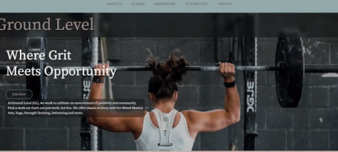
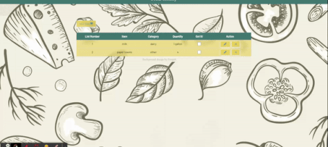

<h1 align="center"> Melissa Escue   
    
    
    
    
    </h1>
    

Hi, I'm a freelance software engineer with a background in teaching. Teaching during the pandemic was stressful, but it opened me up to a virtual world Ilove. I now build and deploy websites a full-stack applications.
<!-- Hi, I'm a freelance software engineer with a background in teaching. Teaching during the pandemic was stressful, but it opened me up to a virtual world I love. I nowbuild and deploy websites a full-stack applications. -->

    

  
  
  
  

    
<table align="center" bordercolor="#3B3530">
        <tr>
            <td width="50%" valign="top">
                <h3 align="center">TheLittleFlowerShop</h3>
                 
                    
                 
                

                     
                    
                
Flower shop website for a potential client

            </td>
            <td width="50%" valign="top">
                <h3 align="center">Mrs, B's Art Room</h3>
                 
                    
                 
                

                    
                    
                

                
A website that I used to organize and share lessons. All identifying and student work has been changed for privacy.

            </td>
        </tr>
        <tr>
            <td width="50%" valign="top">
                <h3 align="center">Ground Level </h3>
                 
                    
                 
                

                    
                
Gym website and practicing with bootstrap.

            </td>
            <td width="50%" valign="top">
                <h3 align="center">Simple Grocery App</h3>
                 
                    
                 
                

                    
                    
                

                
App I made to experiment with Checkboxes

            </td>
        </tr>
       <!-- <tr>
            <td width="50%" valign="top">
                <h3 align="center">A</h3>
                 
                    
                 
                

                    
                
Coaching for runners

            </td>
            <td width="50%" valign="top">
                <h3 align="center">Portfolio</h3>
                 
                    
                 
                

                    
                    
                

                
Personal portfolio page

            </td>
        </tr> -->
    </table>

<h3 align="center">Connect with me:</h3>

<a href="https://twitter.com/mel54924853" target="blank"><svg role="img" xmlns="http://www.w3.org/2000/svg" viewBox="0 0 24 24"><title>Twitter icon</title><path d="M23.953 4.57a10 10 0 01-2.825.775 4.958 4.958 0 002.163-2.723c-.951.555-2.005.959-3.127 1.184a4.92 4.92 0 00-8.384 4.482C7.69 8.095 4.067 6.13 1.64 3.162a4.822 4.822 0 00-.666 2.475c0 1.71.87 3.213 2.188 4.096a4.904 4.904 0 01-2.228-.616v.06a4.923 4.923 0 003.946 4.827 4.996 4.996 0 01-2.212.085 4.936 4.936 0 004.604 3.417 9.867 9.867 0 01-6.102 2.105c-.39 0-.779-.023-1.17-.067a13.995 13.995 0 007.557 2.209c9.053 0 13.998-7.496 13.998-13.985 0-.21 0-.42-.015-.63A9.935 9.935 0 0024 4.59z"  alt="Melissa_Twitter" height="30" width="40"></svg></a>

<h3 align="center">Languages and Tools:</h3>

   <a href="https://developer.mozilla.org/en-US/docs/Web/JavaScript" target="_blank"rel="noreferrer">  <a>      

    